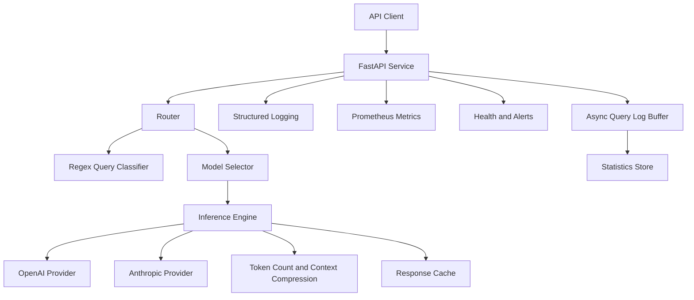
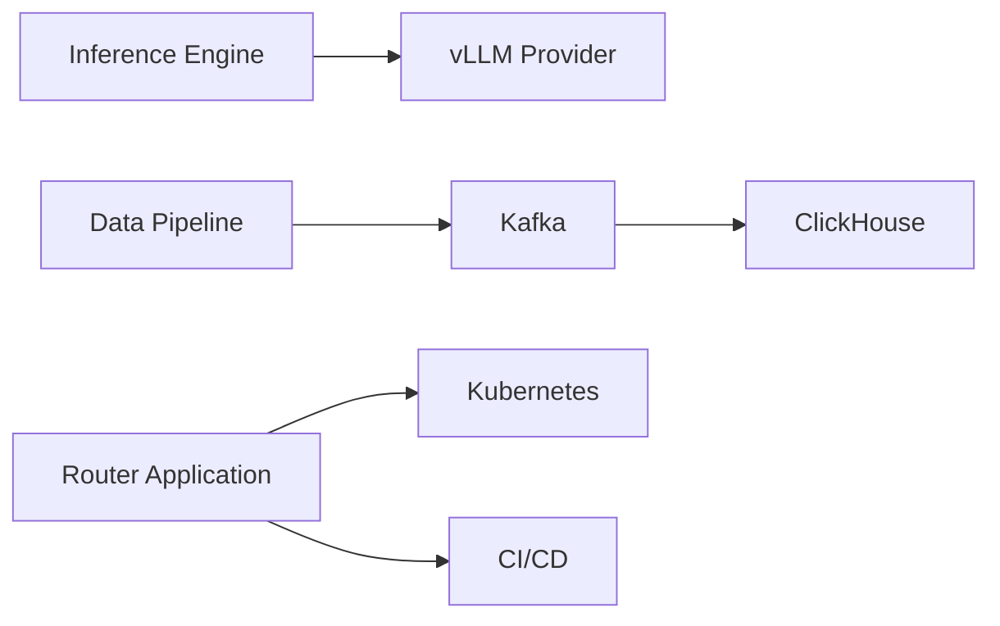
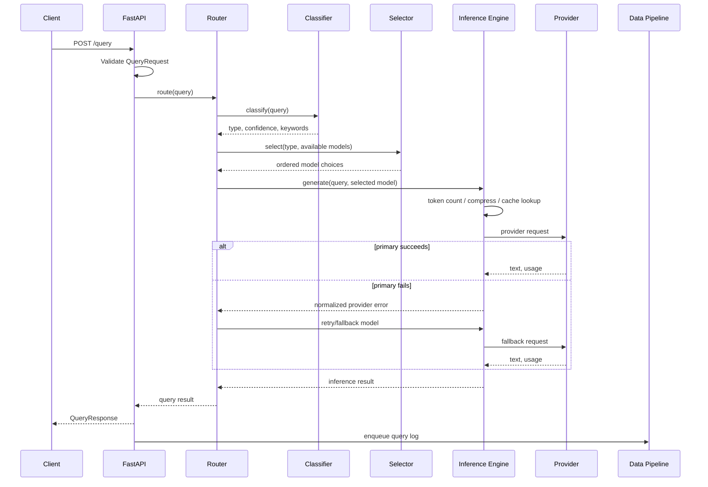

# Source-Aligned LLM Router Architecture

Status: implementation architecture  
Scope: only capabilities explicitly present in `Slack.AI LLM Router Platform.md`  
Priorities: `P0` is required; `P1` is an explicitly named source extension implemented only after P0.

## 1. Architecture priorities

### P0 — Required path



### P1 — Source extensions



P1 components are not dependencies of the first complete release.

## 2. Request flow



Logging and metrics wrap the complete flow. Health monitoring checks the API and provider states separately.

## 3. Recommended project structure

This expands the source's flat example only enough to keep required components testable:

```text
llmRouter/
├── src/llm_router/
│   ├── __init__.py
│   ├── api.py
│   ├── config.py
│   ├── models.py
│   ├── classifier.py
│   ├── selector.py
│   ├── router.py
│   ├── inference.py
│   ├── context.py
│   ├── cache.py
│   ├── providers/
│   │   ├── __init__.py
│   │   ├── base.py
│   │   ├── openai.py
│   │   └── anthropic.py
│   ├── logging_config.py
│   ├── metrics.py
│   ├── monitor.py
│   └── pipeline.py
├── config/
│   └── config.yaml
├── tests/
│   ├── test_config.py
│   ├── test_classifier.py
│   ├── test_selector.py
│   ├── test_inference.py
│   ├── test_api.py
│   ├── test_monitor.py
│   └── test_pipeline.py
├── logs/
├── data/
├── requirements.txt
├── .gitignore
├── Dockerfile
├── docker-compose.yml
└── README.md
```

P1 may later add Kafka/ClickHouse configuration, vLLM adapter, Kubernetes manifests, and CI/CD files.

## 4. Component responsibilities

### 4.1 Configuration — P0

Owns:

- YAML loading.
- Pydantic validation.
- API, logging, router, inference, model, cache, monitor, and pipeline settings.
- Environment-variable references for `OPENAI_API_KEY` and `ANTHROPIC_API_KEY`.

It must not call providers or contain routing decisions.

Example configuration shape:

```yaml
api:
  host: 0.0.0.0
  port: 8000

logging:
  level: INFO
  file: logs/llm-router.log

router:
  strategy: intelligent
  fallback_enabled: true

inference:
  timeout_seconds: 30
  max_retries: 2

cache:
  enabled: true
  ttl_seconds: 300

models:
  - name: openai-primary
    provider: openai
    model_name: provider-model-id
    enabled: true
    priority: 100
    weight: 0.6
    cost_per_1k_tokens: 0.01
    avg_latency_ms: 900
    query_types: [CODE_GENERATION, CODE_ANALYSIS, GENERAL]
```

Actual provider model IDs and prices belong in configuration, not hard-coded selector logic.

### 4.2 Query classifier — P0

Input: query string.  
Output: query type, confidence, matched keywords.

Rules:

- Compile regex patterns once.
- Normalize case/whitespace before matching.
- Score every type, not only the first match.
- Clamp confidence to `[0.0, 1.0]`.
- Use deterministic tie-breaking for mixed queries.
- Return `GENERAL` when nothing matches.

Required types are exactly the six source types.

### 4.3 Model selector — P0

Input:

- classification;
- configured models;
- model availability;
- selected strategy.

Output:

- primary model;
- ordered fallback models;
- strategy name.

Required strategies:

| Strategy | Selection rule |
|---|---|
| Intelligent | Highest-priority suitable model for the classified query type |
| Round robin | Rotate through enabled suitable models |
| Weighted | Random selection using configured positive weights |
| Cost optimized | Cheapest suitable model |
| Latency optimized | Suitable model with lowest configured/observed latency |

The selector must handle an empty candidate list with a typed error.

### 4.4 Router service — P0

Coordinates the classifier, selector, inference engine, retry/fallback, logging, metrics, and async pipeline event. It returns a typed `QueryResult` to the API.

The router—not the FastAPI endpoint—owns classification and model selection.

### 4.5 Provider abstraction — P0

```python
class LLMProvider(Protocol):
    async def generate(self, request: InferenceRequest) -> InferenceResult: ...

    def stream(
        self, request: InferenceRequest
    ) -> AsyncIterator[InferenceStreamEvent]: ...

    async def health_check(self) -> bool: ...
```

Required adapters:

- OpenAI.
- Anthropic.

P1 adapter:

- vLLM.

Each adapter translates requests, normalizes output/usage, handles provider errors/timeouts, and supports the provider streaming requirement.

### 4.6 Context manager — P0

Responsibilities:

- Estimate/count input tokens.
- Compare input plus requested output with the selected model limit.
- Compress or truncate overlong input according to configuration.
- Report original and compressed token estimates for logs/metrics.

Compression must not run recursively. Tests must cover an input exactly at the limit and above the limit.

### 4.7 Response cache — P0

Responsibilities:

- Build a deterministic key from query and relevant generation/model settings.
- Return unexpired cached results.
- Store successful results with TTL.
- Track hit/miss behavior.

An in-memory TTL cache is sufficient for P0. Distributed caching is not a source requirement.

### 4.8 FastAPI service — P0

Required routes:

- `POST /query`
- `GET /models`
- `GET /stats`
- `GET /health`
- `GET /metrics`

The API validates requests/responses with Pydantic and uses one error envelope. Detailed payloads are in [the source-aligned API specification](04-api-specification.md).

### 4.9 Structured logging — P0

Required behavior:

- Console and file handlers.
- Structured formatter.
- Request ID and user ID context.
- Four required log levels.
- Query lifecycle, selection, provider failure/retry, final usage/latency, and alert events.
- API keys are never logged.

### 4.10 Prometheus metrics — P0

Required metrics:

```text
llm_router_requests_total
llm_router_request_latency_seconds
llm_router_tokens_used_total
llm_router_model_selections_total
llm_router_errors_total
```

`GET /metrics` uses Prometheus text exposition. Labels should be bounded values such as endpoint, model, provider, query type, and error type.

### 4.11 Health and alert monitor — P0

Health state contains:

- overall status;
- API status;
- OpenAI status;
- Anthropic status;
- models available;
- uptime seconds.

Provider checks should use configured timeouts and must not crash the API. Alerts are generated when configured latency or error-rate thresholds are crossed, sent through a notifier interface, and stored in alert history.

### 4.12 Data pipeline and statistics — P0

P0 implementation:

```text
API/Router -> asyncio.Queue -> consumer task -> log/statistics store
```

The request path enqueues query records. A background consumer buffers/writes them and updates:

- total requests;
- per-model requests;
- token total;
- estimated cost;
- average/latency distribution;
- error counts if included in statistics.

P1 replaces or extends the queue/store with Kafka and ClickHouse without changing `/query` or `/stats`.

### 4.13 Deployment — P0/P1

P0:

- Dockerfile.
- Docker Compose.
- Environment variables.
- Volumes for logs/data.
- `/health` health check.
- Deployment and troubleshooting documentation.

P1:

- Kubernetes.
- CI/CD.

## 5. Core data contracts

```python
class QueryRequest(BaseModel):
    query: str = Field(min_length=1, max_length=10_000)
    user_id: str | None = Field(default=None, max_length=100)
    session_id: str | None = Field(default=None, max_length=100)

class QueryResponse(BaseModel):
    response: str
    model_used: str
    query_type: QueryType
    tokens_used: int
    latency_ms: float
    timestamp: datetime

class ClassificationResult(BaseModel):
    query_type: QueryType
    confidence: float = Field(ge=0.0, le=1.0)
    keywords: list[str]

class Usage(BaseModel):
    prompt_tokens: int
    completion_tokens: int
    total_tokens: int
```

Configuration, health, statistics, and alert models follow the fields in the source requirement and API specification.

## 6. Error model

Internal categories:

- validation error;
- no available model;
- provider timeout;
- provider rate limit;
- provider authentication/configuration failure;
- provider server/network failure;
- context too long/compression failure;
- internal error.

Example public envelope:

```json
{
  "error": {
    "code": "no_available_model",
    "message": "No configured model is currently available.",
    "request_id": "req-123"
  }
}
```

Do not return raw provider keys or stack traces.

## 7. Retry and fallback rules

1. Retry only provider timeouts, rate limits, network errors, or retryable server errors.
2. Use configured attempt limits and exponential backoff.
3. Do not retry invalid input or provider authentication errors indefinitely.
4. After same-model retries are exhausted, use the next selector fallback when enabled.
5. If all models fail, return the controlled no-available-model/provider error.
6. Record attempts, selected model, latency, tokens, and errors.

The source requires provider streaming but does not specify public SSE. P0 streaming tests therefore target provider adapters/inference aggregation, not an additional public endpoint.

## 8. Application lifecycle

Startup:

1. Load/validate YAML and environment variables.
2. Configure logs and metrics.
3. Build classifier, selector, providers, context manager, and cache.
4. Start the async pipeline consumer and alert monitor.
5. Record application start time.

Shutdown:

1. Stop accepting new work.
2. Flush/stop the pipeline consumer.
3. Close provider HTTP clients.
4. Close log handlers/resources.

## 9. Testing boundaries

| Test group | Required proof |
|---|---|
| Configuration | Valid/invalid YAML and environment overrides |
| Classifier | Six types, GENERAL, mixed query, confidence bounds |
| Selector | Five strategies, disabled model, fallback, empty candidates |
| Provider | OpenAI/Anthropic success, stream, timeout, retryable and permanent error |
| Context/cache | Token boundaries, compression, cache hit/miss/expiry |
| API | All five routes, validation, status codes, error envelope |
| Logging/metrics | Context fields, levels, secret exclusion, required metrics |
| Monitor | Health states, threshold alerts, notifier, history |
| Pipeline | Async enqueue/consume/buffer and statistics math |
| Deployment | Image and Compose health smoke test |

Overall coverage must be at least 70%, as required by the submission criteria.

## 10. Implementation order

1. `P0` configuration and models.
2. `P0` classifier and all tests.
3. `P0` selector, strategies, and fallback.
4. `P0` fake provider test double, then OpenAI/Anthropic adapters.
5. `P0` context compression and cache.
6. `P0` five APIs.
7. `P0` logging, metrics, health, alerts, pipeline, and statistics.
8. `P0` Docker/Compose, documentation, and coverage gate.
9. `P1` vLLM, Kafka/ClickHouse, Kubernetes, and CI/CD only after P0 completion.
