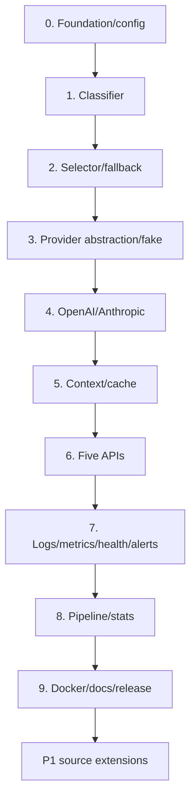

# Source-Required LLM Router Development Plan

Status: executable plan  
Scope: only `Slack.AI LLM Router Platform.md`  
Target: finish every P0 requirement before starting P1 source extensions.

## 1. Priority policy

### P0 — Required now

P0 includes every detailed task, top-level objective, grading item, and submission requirement:

1. Initialization and configuration.
2. Query classification.
3. Model selection and fallback.
4. OpenAI/Anthropic inference, streaming, retry, usage, context compression, and response cache.
5. Five HTTP endpoints: `/query`, `/models`, `/stats`, `/health`, `/metrics`.
6. Structured file/console logging and Prometheus metrics.
7. Health monitoring, alert rules/notifier/history.
8. Async query logging and statistics.
9. Docker, Compose, deployment and troubleshooting documentation.
10. Complete code, README, API docs, test report, and at least 70% coverage.

### P1 — Source extensions after P0

- vLLM provider.
- Kafka and ClickHouse.
- Kubernetes.
- CI/CD.

### Out of scope

Do not schedule unrelated enterprise control-plane, multi-tenant, authentication, quota, policy-management, evaluation, or additional API work during this plan.

## 2. Milestone dependency order

Keep the application runnable and tests green after each milestone.

## 3. Milestone 0 — Project foundation and configuration

Priority: `P0`  
Source score: 10 points

### Tasks

- `M0-01` Create virtual environment and dependency file.
- `M0-02` Create source/test/config/log/data directories.
- `M0-03` Add `.gitignore` and document required environment variables without secrets.
- `M0-04` Define Pydantic models for API, logging, router, inference, cache, and models.
- `M0-05` Implement YAML loader.
- `M0-06` Load OpenAI/Anthropic keys from environment variables.
- `M0-07` Add configuration validation tests.
- `M0-08` Add basic test/coverage command.

### Exit criteria

- Valid configuration loads.
- Invalid configuration fails with useful validation errors.
- Provider keys are not present in YAML, git, or configuration logs.
- Package imports and tests run.

## 4. Milestone 1 — Query classifier

Priority: `P0`  
Source score: 10 points

### Tasks

- `M1-01` Define `QueryType` and `ClassificationResult`.
- `M1-02` Create regex rules for all six types.
- `M1-03` Normalize query text.
- `M1-04` Score all matching classes and clamp confidence.
- `M1-05` Define deterministic tie/mixed-query behavior.
- `M1-06` Default unmatched queries to `GENERAL`.
- `M1-07` Add type, edge, mixed, and score-bound tests.

### Exit criteria

- Each required type has multiple passing examples.
- Mixed and unmatched behavior is documented/tested.
- Output contains type, confidence, and matched keywords.

## 5. Milestone 2 — Model selector and routing plan

Priority: `P0`  
Source score: 10 points

### Tasks

- `M2-01` Add model provider/name/capability/priority/cost/weight/latency/enabled configuration.
- `M2-02` Filter disabled, unavailable, and unsupported models.
- `M2-03` Implement intelligent strategy.
- `M2-04` Implement round robin.
- `M2-05` Implement weighted selection.
- `M2-06` Implement cost optimized.
- `M2-07` Implement latency optimized.
- `M2-08` Return ordered fallbacks.
- `M2-09` Add typed no-model error.
- `M2-10` Add deterministic strategy/fallback tests.

### Exit criteria

- All five strategies pass tests.
- An explicitly empty available-model set selects nothing.
- Primary unavailability produces a fallback.
- Complete unavailability returns a controlled error.

## 6. Milestone 3 — Provider contract and fake provider

Priority: `P0` supporting work  
Purpose: make inference/router/API testable without paid network calls.

### Tasks

- `M3-01` Define `InferenceRequest`, `InferenceResult`, and `Usage`.
- `M3-02` Define `LLMProvider` generate/stream/health contract.
- `M3-03` Implement provider factory.
- `M3-04` Define normalized retryable/permanent provider errors.
- `M3-05` Implement programmable fake success, timeout, error, stream, and usage scenarios.
- `M3-06` Create shared provider contract tests.
- `M3-07` Implement retry helper with bounded exponential backoff.

### Exit criteria

- Fake provider supports deterministic non-streaming and streaming tests.
- Retryable errors retry only to configured maximum.
- Permanent errors do not retry.
- Provider factory rejects unknown provider cleanly.

## 7. Milestone 4 — OpenAI and Anthropic adapters

Priority: `P0`  
Source score: part of the 15-point inference engine

### Tasks

- `M4-01` Verify current official SDK methods, error types, usage, and streaming events.
- `M4-02` Implement OpenAI request/response translation.
- `M4-03` Implement OpenAI async streaming and usage normalization.
- `M4-04` Implement OpenAI error mapping.
- `M4-05` Implement Anthropic request/response translation.
- `M4-06` Implement Anthropic async streaming and usage normalization.
- `M4-07` Implement Anthropic error mapping.
- `M4-08` Run shared contract tests with mocked SDK/network fixtures.
- `M4-09` Add optional minimal live smoke scripts if keys are available.

### Exit criteria

- Both adapters return the same internal result type.
- Both support streaming.
- Token usage and latency are recorded.
- Timeout, rate limit, authentication, and server errors are normalized/tested.

## 8. Milestone 5 — Context compression and response caching

Priority: `P0`  
Source score: inference context points plus task objective

### Tasks

- `M5-01` Implement model-aware token counter/estimator.
- `M5-02` Compare query/output reserve with context limit.
- `M5-03` Implement configured compression/truncation.
- `M5-04` Add exact-boundary and over-limit tests.
- `M5-05` Implement bounded in-memory TTL cache.
- `M5-06` Build stable query/model/settings key.
- `M5-07` Add hit, miss, expiry, key difference, and no-cache-on-error tests.
- `M5-08` Integrate context/cache into inference flow.

### Exit criteria

- Overlong input is compressed or fails with a controlled error.
- Cache hit avoids a provider call.
- Cache expiry and maximum entries are enforced.

## 9. Milestone 6 — FastAPI endpoints

Priority: `P0`  
Source score: 15 points plus metrics endpoint

### Required endpoints

- `POST /query`
- `GET /models`
- `GET /stats`
- `GET /health`
- `GET /metrics`

### Tasks

- `M6-01` Implement Pydantic `QueryRequest` and `QueryResponse`.
- `M6-02` Build application lifespan and services once at startup.
- `M6-03` Implement `/query` router flow.
- `M6-04` Implement `/models` availability list.
- `M6-05` Implement initial `/stats` contract backed by pipeline statistics.
- `M6-06` Implement `/health` contract backed by monitor.
- `M6-07` Expose Prometheus `/metrics`.
- `M6-08` Implement unified error envelope/status mapping.
- `M6-09` Add API integration tests for success, validation, and each controlled failure.
- `M6-10` Commit endpoint documentation/examples.

### Exit criteria

- All five paths exactly match `docs/04-api-specification.md`.
- Invalid query/user/session input is rejected.
- Provider/model failures use the unified error envelope.
- No additional business/admin endpoints are required.

## 10. Milestone 7 — Logging, metrics, health, and alerts

Priority: `P0`  
Source score: 20 points across Parts 6 and 7

### Tasks

- `M7-01` Configure structured console logs.
- `M7-02` Configure structured file logs.
- `M7-03` Bind request ID and user ID context.
- `M7-04` Implement request, latency, token, model selection, and error metrics.
- `M7-05` Test `/metrics` output.
- `M7-06` Track application uptime.
- `M7-07` Check OpenAI and Anthropic availability with timeouts.
- `M7-08` Calculate healthy/degraded/unhealthy state.
- `M7-09` Implement latency alert rule.
- `M7-10` Implement error-rate alert rule.
- `M7-11` Implement notifier protocol and log notifier.
- `M7-12` Record/resolve alert history.
- `M7-13` Test logs for API-key leakage.

### Exit criteria

- Console and file logs contain required context and levels.
- All five Prometheus metrics are present and change in tests.
- `/health` reports components and uptime.
- Thresholds create notifications and history entries.

## 11. Milestone 8 — Async data pipeline and statistics

Priority: `P0`  
Source score: 10 points

### Tasks

- `M8-01` Define query log record with query, response, model, tokens, latency, cost, timestamp.
- `M8-02` Implement bounded `asyncio.Queue`.
- `M8-03` Implement background consumer and buffer/batch behavior.
- `M8-04` Implement shutdown flush.
- `M8-05` Calculate total requests.
- `M8-06` Calculate per-model counts.
- `M8-07` Calculate total tokens and estimated cost.
- `M8-08` Calculate average/latency distribution.
- `M8-09` Connect router completion to queue publication.
- `M8-10` Complete `/stats` integration tests.

### Exit criteria

- Query response does not synchronously perform pipeline storage.
- Every successful test query appears in pipeline records.
- Known records produce exact expected statistics.
- Empty statistics return zeros safely.

## 12. Milestone 9 — Docker, Compose, tests, and documentation

Priority: `P0`  
Source score: 10 deployment points plus submission requirements

### Tasks

- `M9-01` Write Dockerfile.
- `M9-02` Pass environment variables at runtime.
- `M9-03` Write Docker Compose service, volumes, and `/health` check.
- `M9-04` Verify build/run/query/health commands.
- `M9-05` Document every environment variable.
- `M9-06` Write troubleshooting guide.
- `M9-07` Complete README installation/usage/architecture/API examples.
- `M9-08` Complete API documentation.
- `M9-09` Run full unit/API/integration suite.
- `M9-10` Generate coverage report and reach at least 70%.
- `M9-11` Produce final test report.

### Exit criteria

- Clean setup can start with documented commands.
- Docker Compose health succeeds under valid configuration.
- README, API docs, deployment guide, and troubleshooting are complete.
- Coverage is at least 70% and all required scenarios pass.

## 13. P0 release checklist

### Part 1 — Configuration

- [ ] Standard project structure
- [ ] Virtual environment/dependencies
- [ ] Ignore files
- [ ] YAML/Pydantic configuration

### Part 2 — Classifier

- [ ] Six types
- [ ] Regex scoring/confidence
- [ ] Edge/mixed queries
- [ ] Routing integration

### Part 3 — Selector

- [ ] Model capability/priority/cost configuration
- [ ] Intelligent
- [ ] Round robin
- [ ] Weighted
- [ ] Cost optimized
- [ ] Latency optimized
- [ ] Fallback and total-failure behavior

### Part 4 — Inference/context/cache

- [ ] Provider abstraction/factory
- [ ] OpenAI generate/stream/error/retry/usage
- [ ] Anthropic generate/stream/error/retry/usage
- [ ] Token count and context compression
- [ ] Response cache

### Part 5 — API

- [ ] `/query`
- [ ] `/models`
- [ ] `/stats`
- [ ] `/health`
- [ ] Validation and unified errors/statuses

### Part 6 — Observability

- [ ] Console/file structured logs
- [ ] Request/user context
- [ ] Four log levels
- [ ] Five required metric families
- [ ] `/metrics`

### Part 7 — Monitor

- [ ] Component/provider health
- [ ] Detailed health/uptime
- [ ] Latency/error-rate rules
- [ ] Notifier interface
- [ ] Alert history

### Part 8 — Pipeline

- [ ] Query detail records
- [ ] Async logging/buffering
- [ ] Model/tokens/cost/latency stats

### Part 9 — Deployment/submission

- [ ] Dockerfile
- [ ] Compose services/volumes/health
- [ ] Deployment/environment/troubleshooting docs
- [ ] Complete code/tests
- [ ] README
- [ ] At least 70% test coverage/report
- [ ] API documentation

## 14. P1 backlog — blocked until P0 release

| ID | Source extension | Entry condition | Completion proof |
|---|---|---|---|
| `P1-01` | vLLM adapter | OpenAI/Anthropic contract suite passes | vLLM passes same suite |
| `P1-02` | Kafka pipeline | P0 async queue/stats passes | Produce/consume integration test |
| `P1-03` | ClickHouse storage | Kafka contract stable | Stored records and `/stats` validation |
| `P1-04` | Kubernetes | Docker/Compose release passes | Deployment/health smoke test |
| `P1-05` | CI/CD | Local commands stable | Automated test/build workflow |

P1 does not add public APIs or change P0 response contracts.

## 15. Definition of done for each issue

- Requirement and priority are named.
- Success and important failure tests pass.
- Configuration is documented.
- Logs/metrics are added where the source requires them.
- API keys are not exposed.
- Related Markdown is updated.
- Full test suite remains green.

## 16. Suggested schedule

This is an order, not a fixed promise:

| Week | Focus |
|---:|---|
| 1 | Milestones 0–1: foundation and classifier |
| 2 | Milestone 2: selection and fallback |
| 3 | Milestone 3: provider contract/fake/retry |
| 4 | Milestone 4: OpenAI and Anthropic |
| 5 | Milestone 5: context and cache |
| 6 | Milestone 6: APIs |
| 7 | Milestone 7: logs, metrics, health, alerts |
| 8 | Milestone 8: pipeline and statistics |
| 9 | Milestone 9: Docker, docs, test report, release |

If a week slips, move the schedule; do not skip P0 tests to begin P1.

## 17. Resume evidence within source scope

Record honest measurements as you implement:

- Classifier test-set accuracy/confusion examples.
- Selection and fallback test cases.
- Provider retry/failure scenarios.
- Cache hit-rate in a controlled test.
- Request latency and token/cost statistics.
- Coverage percentage and test count.
- Docker startup/health result.

Resume template after measurement:

> Built a FastAPI multi-model LLM router integrating OpenAI and Anthropic with regex query classification, five configurable selection strategies, retries/fallback, context compression, caching, Prometheus monitoring, and asynchronous usage analytics; achieved `[measured coverage]` test coverage across `[measured test count]` tests.

Do not claim features from the removed out-of-scope enterprise expansion.
