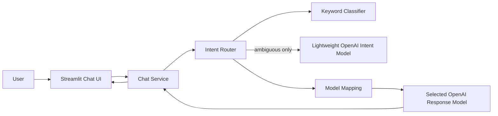

# Bare-Minimum LLM Router MVP Requirements

Status: implemented; live OpenAI smoke validation pending  
Current implementation priority: **P0 — validate only this MVP**  
Date reviewed against official OpenAI documentation: 2026-08-12

## 1. MVP objective

Build a small working LLM router that demonstrates the central idea of the project:

1. A user enters a message in a Streamlit chat interface.
2. The backend infers the user's intent with a hybrid keyword and lightweight-LLM classifier.
3. The router selects an OpenAI model appropriate for that intent.
4. The selected model generates the assistant response.
5. The response appears in the Streamlit conversation.

This MVP should be easy to understand, run locally, test, and demonstrate. It intentionally excludes the larger requirements in the other planning documents until this vertical slice works.

## 2. Confirmed P0 decisions

The following defaults were approved for implementation:

| Decision | Proposed MVP default |
|---|---|
| Deployment shape | One Streamlit process with separate Python service modules; no FastAPI service yet |
| Provider | OpenAI only |
| OpenAI API | Responses API through LangChain's OpenAI integration |
| Chat input | Text only |
| Chat history | Store in `st.session_state`; send the most recent 10 messages to the response model |
| Intent classes | Keep the original six: code generation, code analysis, analysis, summarization, creative writing, general |
| Hybrid classification | Use keyword rules first; call the lightweight LLM only when keyword evidence is missing or ambiguous |
| Intent model | `gpt-5.4-nano` with Structured Outputs |
| Response model routing | `gpt-5.6-sol`, `gpt-5.6-terra`, and `gpt-5.6-luna` by intent |
| Response display | Non-streaming for the first MVP |
| Persistence | None; browser refresh starts a new conversation |
| Authentication | None; local demonstration only |

The model IDs must remain configurable because account access and available model IDs can vary.

The P0 implementation uses LangChain's `init_chat_model` with `model_provider="openai"`. One `LLMRouter` class owns keyword classification, ambiguous LLM classification, model selection, history conversion, and response generation. This keeps the complete backend flow visible in one file. LangChain model creation remains injectable so tests can use fakes without network calls.

## 3. Why these OpenAI models

The model choices below are current suggestions rather than permanent hard-coded requirements.

- `gpt-5.4-nano` is designed for high-volume simple tasks including classification, ranking, and extraction, and supports Structured Outputs. That makes it a suitable lightweight intent classifier. See the [official GPT-5.4 nano model page](https://developers.openai.com/api/docs/models/gpt-5.4-nano).
- OpenAI currently describes `gpt-5.6-sol` as the flagship option for complex reasoning and coding, `gpt-5.6-terra` as the intelligence/cost balance, and `gpt-5.6-luna` as the cost-sensitive, high-volume option. See the [official OpenAI model catalog](https://developers.openai.com/api/docs/models).
- Structured Outputs enforce a schema rather than merely returning valid JSON. The LangChain gateway requests OpenAI's native JSON Schema method and validates the result with the Pydantic `IntentResult` model. See the [official Structured Outputs guide](https://developers.openai.com/api/docs/guides/structured-outputs).

Use configuration aliases so the application logic does not depend directly on model IDs:

```yaml
models:
  intent: gpt-5.4-nano
  high_quality: gpt-5.6-sol
  balanced: gpt-5.6-terra
  economy: gpt-5.6-luna
```

## 4. MVP architecture



“Backend” in this proposal means the Python service layer called by Streamlit in the same process. Keeping UI, routing, and OpenAI code in separate modules makes a future FastAPI extraction straightforward without adding a second service now.

## 5. Required user experience

### 5.1 Initial page

The page shows:

- Application title: `LLM Router Chat`.
- One-sentence description.
- Chat history area.
- Streamlit chat input with placeholder: `Ask me anything...`.
- Optional sidebar showing the configured intent and response model aliases.

### 5.2 Submit a message

When the user submits non-empty text:

1. Display the user message immediately with `st.chat_message("user")`.
2. Add it to `st.session_state.messages`.
3. Show a spinner such as `Choosing the best model...`.
4. Classify the current user message.
5. Select the response model.
6. Call OpenAI with recent chat history.
7. Display the assistant response with `st.chat_message("assistant")`.
8. Add the response and routing metadata to session state.

### 5.3 Routing information

For demonstration and debugging, show a small caption below each assistant response:

```text
Intent: CODE_GENERATION · Classified by: keyword · Model: gpt-5.6-sol
```

This can be hidden later, but it is useful for proving that routing actually happened.

### 5.4 Error experience

Show a friendly error without crashing or deleting chat history:

```text
The model request could not be completed. Please try again.
```

Log the internal error type locally, but never display or log `OPENAI_API_KEY`.

## 6. Intent taxonomy

Use the six intent classes from the original project requirement:

| Intent | Meaning | Example |
|---|---|---|
| `CODE_GENERATION` | Create, implement, or refactor code | “Write a Python LRU cache.” |
| `CODE_ANALYSIS` | Explain, review, debug, or optimize code | “Why does this async function deadlock?” |
| `ANALYSIS` | Compare, research, reason, or evaluate | “Compare event sourcing and CRUD.” |
| `SUMMARIZATION` | Summarize, condense, paraphrase, or translate | “Summarize this report in five bullets.” |
| `CREATIVE_WRITING` | Brainstorm or create stories/articles/content | “Write a short science-fiction opening.” |
| `GENERAL` | General chat or anything without a stronger match | “What is the capital of Canada?” |

The MVP assigns one primary intent per user message.

## 7. Hybrid intent-classification requirements

### 7.1 Stage 1: keyword classifier

The keyword classifier runs for every user message. It must:

- normalize text to lowercase;
- match configured keywords/regex patterns;
- score every intent;
- compute the top intent and its margin over the second-highest score;
- produce the same result for the same input.

Suggested starting keyword groups:

```python
KEYWORDS = {
    "CODE_GENERATION": [
        "write code", "implement", "create a function", "build a class",
        "refactor", "python", "javascript", "typescript", "java", "rust",
    ],
    "CODE_ANALYSIS": [
        "debug", "review this code", "explain this code", "bug",
        "stack trace", "optimize this function", "why does this fail",
    ],
    "ANALYSIS": [
        "analyze", "compare", "evaluate", "trade-off", "research",
        "pros and cons", "root cause",
    ],
    "SUMMARIZATION": [
        "summarize", "summary", "condense", "paraphrase", "translate",
        "key points", "tl;dr",
    ],
    "CREATIVE_WRITING": [
        "story", "poem", "brainstorm", "creative", "blog post",
        "article", "marketing copy",
    ],
}
```

Keyword lists belong in configuration or a dedicated rules module, not scattered through the Streamlit UI.

### 7.2 Keyword confidence rule

Recommended initial rule:

- `confident`: one intent has at least two matches and leads the second-highest intent by at least one match;
- `ambiguous`: tied top scores, only one weak match, or conflicting intent groups;
- `no_match`: no intent keyword matches.

If confident, use the keyword result. If ambiguous or no match, invoke the lightweight LLM.

These are heuristic scores, not statistical probabilities.

### 7.3 Stage 2: lightweight LLM classifier

Call the configured intent model with:

- a fixed system instruction defining exactly the six intents;
- the latest user message only for the first MVP;
- no conversation answer-generation task;
- a small output budget;
- Structured Outputs matching `IntentResult`.

Required schema:

```python
class IntentResult(BaseModel):
    intent: Literal[
        "CODE_GENERATION",
        "CODE_ANALYSIS",
        "ANALYSIS",
        "SUMMARIZATION",
        "CREATIVE_WRITING",
        "GENERAL",
    ]
    confidence: float = Field(ge=0.0, le=1.0)
```

Do not request or store chain-of-thought. A category and confidence are enough for routing.

### 7.4 Classifier failure

If the lightweight classifier times out, refuses, returns no parsed result, or raises an API error:

- use the keyword top result if one exists;
- otherwise use `GENERAL`;
- mark `classifier_source` as `fallback`;
- continue to response generation when possible.

### 7.5 Final classification result

For this small MVP, classification returns a direct tuple rather than another transport model:

```python
intent, source = router.classify(query)
# Example: (Intent.CODE_GENERATION, "keyword")
```

The LLM-only `IntentResult` remains a Pydantic model because Structured Outputs require a schema.

## 8. OpenAI model-routing table

Proposed mapping:

| Intent | Model alias | Proposed OpenAI model | Reason |
|---|---|---|---|
| `CODE_GENERATION` | `high_quality` | `gpt-5.6-sol` | Complex coding |
| `CODE_ANALYSIS` | `high_quality` | `gpt-5.6-sol` | Code reasoning/debugging |
| `ANALYSIS` | `balanced` | `gpt-5.6-terra` | Balance reasoning quality and cost |
| `CREATIVE_WRITING` | `balanced` | `gpt-5.6-terra` | General quality without always using the flagship model |
| `SUMMARIZATION` | `economy` | `gpt-5.6-luna` | Cost-sensitive focused work |
| `GENERAL` | `economy` | `gpt-5.6-luna` | Default lower-cost chat |

Mapping must be stored in configuration:

```yaml
routing:
  CODE_GENERATION: high_quality
  CODE_ANALYSIS: high_quality
  ANALYSIS: balanced
  CREATIVE_WRITING: balanced
  SUMMARIZATION: economy
  GENERAL: economy
```

The application must display the actual configured model used. It must not imply that the model selection is objectively optimal; this is the MVP's initial rule-based mapping.

## 9. Response-generation requirements

`LLMRouter.chat()` sends the selected OpenAI model:

- a short shared system instruction such as `You are a helpful assistant.`;
- up to the configured number of recent session messages;
- the latest user message;
- a bounded maximum output setting.

The MVP must:

- use LangChain's `init_chat_model` and OpenAI integration;
- set `use_responses_api=True`;
- use `with_structured_output(IntentResult, method="json_schema")` for intent classification;
- cache each initialized response model by model ID rather than rebuilding it for every message;
- read `OPENAI_API_KEY` from the existing local `.env`;
- return plain assistant text;
- record selected intent, classifier source, response model, and latency in memory/logs;
- handle empty output and API errors gracefully.

## 10. Chat-session state

Use `st.session_state`:

```python
st.session_state.messages = [
    {
        "role": "user",
        "content": "Write a Python Fibonacci function.",
    },
    {
        "role": "assistant",
        "content": "Here is an iterative implementation...",
        "routing": {
            "intent": "CODE_GENERATION",
            "classifier_source": "keyword",
            "model": "gpt-5.6-sol",
        },
    },
]
```

Requirements:

- render saved messages after each Streamlit rerun;
- do not send the internal `routing` object as chat content;
- cap context to the most recent 10 messages initially;
- provide a `Clear chat` button;
- do not persist messages to a file or database.

## 11. Configuration and secrets

Required entries in the existing local `.env`:

```text
OPENAI_API_KEY=
INTENT_MODEL=gpt-5.4-nano
HIGH_QUALITY_MODEL=gpt-5.6-sol
BALANCED_MODEL=gpt-5.6-terra
ECONOMY_MODEL=gpt-5.6-luna
CHAT_HISTORY_MESSAGES=10
```

Rules:

- `.env` is ignored by Git.
- The app stops with a clear setup message when `OPENAI_API_KEY` is missing.
- Secret values never appear in the UI or logs.
- Model IDs can be changed without editing router logic.

## 12. Minimal repository structure

```text
llmRouter/
├── app.py                    # Streamlit page and chat rendering
├── src/llm_router/
│   ├── __init__.py
│   ├── config.py             # environment/model settings
│   ├── models.py             # IntentResult and ChatResult
│   └── router.py             # classify, select, and call models
├── tests/
│   ├── test_app.py
│   ├── test_router.py
│   └── test_config.py
├── .gitignore
├── pyproject.toml
├── requirements.txt
└── README.md
```

Minimal runtime dependencies:

```text
streamlit
langchain[openai]
pydantic
python-dotenv
```

Minimal test dependencies:

```text
pytest
pytest-cov
```

## 13. End-to-end flow

```text
1. User enters message.
2. Streamlit saves and displays it.
3. Keyword classifier scores intent.
4. If keyword result is ambiguous/no-match, gpt-5.4-nano classifies it.
5. Router maps final intent to a configured model alias.
6. `LLMRouter.chat()` sends recent conversation to the selected OpenAI model.
7. Streamlit displays the answer and routing caption.
8. Chat/session state retains the conversation until cleared/refreshed.
```

## 14. Required tests

### Keyword classifier

- Clear example for every intent.
- General/no-keyword input.
- Ambiguous input invokes the lightweight classifier.
- Confident keyword input does not invoke the lightweight classifier under the confirmed cascade.
- Matching is case-insensitive.

### Lightweight classifier

- Parsed structured result maps to a valid intent.
- Invalid/empty result falls back safely.
- API exception falls back safely.
- Confidence remains between 0 and 1.

Inject a fake LangChain model factory in automated tests; do not spend API credits in the default test suite.

### Model router

- Every intent maps to the configured model alias.
- Unknown/missing mapping uses the configured economy/default model.
- Changing an environment model ID changes selection without code edits.

### Chat service

- User message produces one response call.
- Response call uses the selected model.
- Recent history is included and capped.
- Routing metadata is not sent as conversation text.
- Empty response and OpenAI error become friendly application errors.

### Streamlit smoke test

- App starts.
- Chat input and clear button render.
- A mocked submission displays user and assistant messages plus routing caption.

## 15. MVP acceptance scenarios

The MVP is ready when all scenarios pass:

1. “Implement a Python REST endpoint” routes to `CODE_GENERATION` and the high-quality model.
2. “Debug this traceback” routes to `CODE_ANALYSIS` and the high-quality model.
3. “Compare Kafka and RabbitMQ” routes to `ANALYSIS` and the balanced model.
4. “Summarize this text” routes to `SUMMARIZATION` and the economy model.
5. “Write a short detective story” routes to `CREATIVE_WRITING` and the balanced model.
6. “Hello, how are you?” routes to `GENERAL` and the economy model.
7. An ambiguous message invokes the lightweight intent model and uses its valid structured result.
8. A failed intent-model call falls back to keyword/general classification.
9. A failed response-model call shows a friendly error and preserves chat history.
10. Clearing chat removes session messages.
11. The API key is absent from source, UI, errors, and logs.
12. `streamlit run app.py` starts the application from documented setup instructions.

## 16. Explicitly deferred

Do not build these in the MVP:

- FastAPI or public REST endpoints.
- Anthropic or local/vLLM providers.
- Public response streaming.
- Docker, Kubernetes, Kafka, ClickHouse, Redis, or databases.
- User login, API-key management, tenants, quotas, or budgets.
- Response caching or context compression.
- Prometheus, dashboards, alerts, or a statistics API.
- Persistent chat history.
- File, image, audio, or tool input.
- Learned routing, feedback loops, or model-quality evaluation.
- Automatic response-model retry/fallback.

These can be introduced after the vertical slice is reviewed and working.

## 17. Implementation order

1. Define `Intent`, `IntentResult`, and application settings.
2. Implement and unit-test keyword classification.
3. Implement lightweight LLM classification with a fake client first.
4. Implement hybrid decision rule.
5. Implement configurable intent-to-model mapping.
6. Add response generation and orchestration to `LLMRouter` using a fake model factory first.
7. Build Streamlit chat UI and session history.
8. Add error handling, clear-chat behavior, and routing caption.
9. Run mocked tests, then perform a small real-API smoke test.
10. Document setup and demo commands.

## 18. Definition of done

- All 12 acceptance scenarios pass.
- All intent/router/service unit tests pass without network access.
- One manually approved real OpenAI smoke test succeeds for each configured response-model alias.
- The app can be started with `streamlit run app.py`.
- Model IDs are configurable.
- `OPENAI_API_KEY` is not committed or exposed.
- README documents environment setup and usage.
- No deferred feature has been added to the MVP implementation.

## 19. Resolved implementation decisions

1. One Streamlit process calls internal Python service modules; there is no FastAPI backend in P0.
2. The lightweight intent model runs only for ambiguous or unmatched keyword results.
3. Sol handles code, Terra handles analysis/creative writing, and Luna handles summarization/general by default.
4. The response model receives at most the latest 10 messages.
5. Responses are non-streaming in P0.
6. LangChain `init_chat_model` is used directly inside the single `LLMRouter` backend class.

## 20. Implementation verification

Completed locally on 2026-08-12:

- all six intent types and all routing-table entries are unit tested;
- keyword, LLM, and deterministic fallback paths are tested;
- history limiting and removal of internal routing metadata are tested;
- the consolidated router tests cover keyword/LLM/fallback classification, all model routes, LangChain message conversion, model configuration, structured output, history limits, errors, and per-model caching;
- friendly empty-output and provider-error behavior is tested;
- Streamlit controls, missing-key behavior, mocked chat submission, routing caption, and clear-chat behavior are smoke tested;
- the installed LangChain OpenAI integration accepts the configured Responses API, reasoning, timeout, token-limit, and structured-output options;
- automated tests pass without network calls or API credits;
- measured branch coverage is recorded in the README after each validation run.

Still pending:

- manually approved live calls for the intent model and each configured response-model alias, because no `OPENAI_API_KEY` is available in the current environment.
