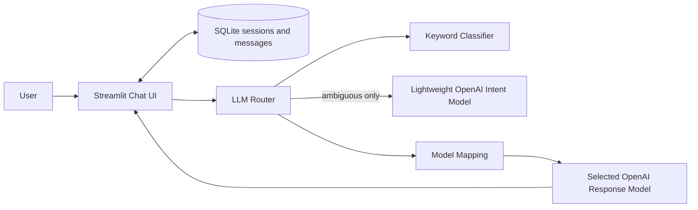

# Bare-Minimum LLM Router MVP Requirements

Status: implemented; live OpenAI smoke validation pending  
Current implementation priority: **P0 — validate only this MVP**  
Date reviewed against official OpenAI documentation: 2026-08-12

## 1. MVP objective

Build a small working LLM router that demonstrates the central idea of the project:

1. A user enters a message in a Streamlit chat interface.
2. The backend infers the user's intent with a hybrid keyword and lightweight-LLM classifier.
3. The router selects an OpenAI model appropriate for that intent.
4. The selected model generates the assistant response.
5. The response appears in the Streamlit conversation.
6. An anonymous URL session restores its conversation from local SQLite storage.
7. A repeatable evaluation suite measures routing decisions.

This MVP should be easy to understand, run locally, test, and demonstrate. It intentionally excludes the larger requirements in the other planning documents until this vertical slice works.

## 2. Confirmed P0 decisions

The following defaults were approved for implementation:

| Decision | Proposed MVP default |
|---|---|
| Deployment shape | One Streamlit process with a router module and a SQLite storage module; no FastAPI service yet |
| Provider | OpenAI only |
| OpenAI API | Responses API through LangChain's OpenAI integration |
| Chat input | Text only |
| Chat history | Store the full conversation in SQLite; send a rolling summary plus token-bounded recent turns to the response model |
| Intent classes | Keep the original six: code generation, code analysis, analysis, summarization, creative writing, general |
| Hybrid classification | Use keyword rules first; call the lightweight LLM only when keyword evidence is missing or ambiguous |
| Intent model | `gpt-5.4-nano` with Structured Outputs |
| Response model routing | `gpt-5.6-sol`, `gpt-5.6-terra`, and `gpt-5.6-luna` by intent |
| Response display | Stream text chunks in Streamlit; return a final `ChatResult` after completion |
| Session identity | UUID v4 in the Streamlit URL query parameter `session_id` |
| Persistence | Local SQLite database at configurable `DATABASE_PATH` |
| Clear behavior | Delete the current session's messages but retain its session ID |
| Authentication | None; possession of the session URL grants access for this local demonstration |

The model IDs must remain configurable because account access and available model IDs can vary.

The P0 implementation uses LangChain's `init_chat_model` with `model_provider="openai"`. One `LLMRouter` class owns keyword classification, ambiguous LLM classification, model selection, history conversion, and response generation. This keeps the complete backend flow visible in one file. LangChain model creation remains injectable so tests can use fakes without network calls.

## 3. Why these OpenAI models

The model choices below are current suggestions rather than permanent hard-coded requirements.

- `gpt-5.4-nano` is designed for high-volume simple tasks including classification, ranking, and extraction, and supports Structured Outputs. That makes it a suitable lightweight intent classifier. See the [official GPT-5.4 nano model page](https://developers.openai.com/api/docs/models/gpt-5.4-nano).
- OpenAI currently describes `gpt-5.6-sol` as the flagship option for complex reasoning and coding, `gpt-5.6-terra` as the intelligence/cost balance, and `gpt-5.6-luna` as the cost-sensitive, high-volume option. See the [official OpenAI model catalog](https://developers.openai.com/api/docs/models).
- Structured Outputs enforce a schema rather than merely returning valid JSON. The LangChain gateway requests OpenAI's native JSON Schema method and validates the result with the Pydantic `IntentResult` model. See the [official Structured Outputs guide](https://developers.openai.com/api/docs/guides/structured-outputs).

Use configuration aliases so the application logic does not depend directly on model IDs:

```yaml
models:
  intent: gpt-5.4-nano
  high_quality: gpt-5.6-sol
  balanced: gpt-5.6-terra
  economy: gpt-5.6-luna
```

## 4. MVP architecture



“Backend” in this proposal means the `LLMRouter` and SQLite helpers called by Streamlit in the same process. Keeping UI, routing, OpenAI, and storage concerns in small modules makes a future FastAPI extraction straightforward without adding a second service now.

## 5. Required user experience

### 5.1 Initial page

The page shows:

- Application title: `LLM Router Chat`.
- One-sentence description.
- Chat history area.
- Streamlit chat input with placeholder: `Ask me anything...`.
- Anonymous session UUID in the sidebar and `session_id` in the page URL.
- Optional sidebar showing the configured intent and response model aliases.

### 5.2 Submit a message

When the user submits non-empty text:

1. Display the user message immediately with `st.chat_message("user")`.
2. Save it to the current SQLite session before calling the model.
3. Show a spinner such as `Choosing the best model...`.
4. Classify the current user message.
5. Select the response model.
6. Call OpenAI with recent chat history.
7. Display non-empty assistant text chunks immediately with a trailing `▌` cursor.
8. Replace the placeholder with the clean final response after the stream completes.
9. Save the response and routing metadata to the same SQLite session only after successful completion.

### 5.3 Routing information

For demonstration and debugging, show a small caption below each assistant response:

```text
Intent: CODE_GENERATION · Classified by: keyword · Model: gpt-5.6-sol · Tokens: 120 in + 40 out = 160 total
```

This can be hidden later, but it is useful for proving that routing actually happened.

### 5.4 Error experience

Show a friendly error without crashing or deleting chat history:

```text
The model request could not be completed. Please try again.
```

Log the internal error type locally, but never display or log `OPENAI_API_KEY`.

## 6. Intent taxonomy

Use the six intent classes from the original project requirement:

| Intent | Meaning | Example |
|---|---|---|
| `CODE_GENERATION` | Create, implement, or refactor code | “Write a Python LRU cache.” |
| `CODE_ANALYSIS` | Explain, review, debug, or optimize code | “Why does this async function deadlock?” |
| `ANALYSIS` | Compare, research, reason, or evaluate | “Compare event sourcing and CRUD.” |
| `SUMMARIZATION` | Summarize, condense, paraphrase, or translate | “Summarize this report in five bullets.” |
| `CREATIVE_WRITING` | Brainstorm or create stories/articles/content | “Write a short science-fiction opening.” |
| `GENERAL` | General chat or anything without a stronger match | “What is the capital of Canada?” |

The MVP assigns one primary intent per user message.

## 7. Hybrid intent-classification requirements

### 7.1 Stage 1: keyword classifier

The keyword classifier runs for every user message. It must:

- normalize text to lowercase;
- match configured keywords/regex patterns;
- score every intent;
- compute the top intent and its margin over the second-highest score;
- produce the same result for the same input.

Suggested starting keyword groups:

```python
KEYWORDS = {
    "CODE_GENERATION": [
        "write code", "implement", "create a function", "build a class",
        "refactor", "python", "javascript", "typescript", "java", "rust",
    ],
    "CODE_ANALYSIS": [
        "debug", "review this code", "explain this code", "bug",
        "stack trace", "optimize this function", "why does this fail",
    ],
    "ANALYSIS": [
        "analyze", "compare", "evaluate", "trade-off", "research",
        "pros and cons", "root cause",
    ],
    "SUMMARIZATION": [
        "summarize", "summary", "condense", "paraphrase", "translate",
        "key points", "tl;dr",
    ],
    "CREATIVE_WRITING": [
        "story", "poem", "brainstorm", "creative", "blog post",
        "article", "marketing copy",
    ],
}
```

Keyword lists belong in configuration or a dedicated rules module, not scattered through the Streamlit UI.

### 7.2 Keyword confidence rule

Recommended initial rule:

- `confident`: one intent has at least two matches and leads the second-highest intent by at least one match;
- `ambiguous`: tied top scores, only one weak match, or conflicting intent groups;
- `no_match`: no intent keyword matches.

If confident, use the keyword result. If ambiguous or no match, invoke the lightweight LLM.

These are heuristic scores, not statistical probabilities.

### 7.3 Stage 2: lightweight LLM classifier

Call the configured intent model with:

- a fixed system instruction defining exactly the six intents;
- the latest user message only for the first MVP;
- no conversation answer-generation task;
- a small output budget;
- Structured Outputs matching `IntentResult`.

Required schema:

```python
class IntentResult(BaseModel):
    intent: Literal[
        "CODE_GENERATION",
        "CODE_ANALYSIS",
        "ANALYSIS",
        "SUMMARIZATION",
        "CREATIVE_WRITING",
        "GENERAL",
    ]
    confidence: float = Field(ge=0.0, le=1.0)
```

Do not request or store chain-of-thought. A category and confidence are enough for routing.

### 7.4 Classifier failure

If the lightweight classifier times out, refuses, returns no parsed result, or raises an API error:

- use the keyword top result if one exists;
- otherwise use `GENERAL`;
- mark `classifier_source` as `fallback`;
- continue to response generation when possible.

### 7.5 Final classification result

For this small MVP, classification returns a direct tuple rather than another transport model:

```python
intent, source = router.classify(query)
# Example: (Intent.CODE_GENERATION, "keyword")
```

The LLM-only `IntentResult` remains a Pydantic model because Structured Outputs require a schema.

## 8. OpenAI model-routing table

Proposed mapping:

| Intent | Model alias | Proposed OpenAI model | Reason |
|---|---|---|---|
| `CODE_GENERATION` | `high_quality` | `gpt-5.6-sol` | Complex coding |
| `CODE_ANALYSIS` | `high_quality` | `gpt-5.6-sol` | Code reasoning/debugging |
| `ANALYSIS` | `balanced` | `gpt-5.6-terra` | Balance reasoning quality and cost |
| `CREATIVE_WRITING` | `balanced` | `gpt-5.6-terra` | General quality without always using the flagship model |
| `SUMMARIZATION` | `economy` | `gpt-5.6-luna` | Cost-sensitive focused work |
| `GENERAL` | `economy` | `gpt-5.6-luna` | Default lower-cost chat |

Mapping must be stored in configuration:

```yaml
routing:
  CODE_GENERATION: high_quality
  CODE_ANALYSIS: high_quality
  ANALYSIS: balanced
  CREATIVE_WRITING: balanced
  SUMMARIZATION: economy
  GENERAL: economy
```

The application must display the actual configured model used. It must not imply that the model selection is objectively optimal; this is the MVP's initial rule-based mapping.

## 9. Response-generation requirements

`LLMRouter.chat()` sends the selected OpenAI model:

- a short shared system instruction such as `You are a helpful assistant.`;
- up to the configured number of recent session messages;
- the latest user message;
- a bounded maximum output setting.

The MVP must:

- use LangChain's `init_chat_model` and OpenAI integration;
- set `use_responses_api=True`;
- use `with_structured_output(IntentResult, method="json_schema")` for intent classification;
- cache each initialized response model by model ID rather than rebuilding it for every message;
- read `OPENAI_API_KEY` from the existing local `.env`;
- return plain assistant text;
- use LangChain's response-model `stream()` iterator and expose text deltas through an optional `on_chunk` callback;
- reconstruct one final `ChatResult` from the accumulated chunks;
- record selected intent, classifier source, response model, latency, and response-model token usage in memory/logs;
- recover usage metadata from the accumulated stream;
- handle empty streams and API errors gracefully;
- discard partial assistant output on stream failure while preserving the stored user message.

Public method:

```python
router.chat(query, history, on_chunk=render_text_delta) -> ChatResult
```

The callback is optional so non-UI callers can wait for the final result without handling deltas. Intent classification remains non-streaming because it returns one small structured object.

`ChatResult` stores the selected response-model usage reported by LangChain's `AIMessage.usage_metadata`:

```python
ChatResult(
    response="...",
    intent=Intent.CODE_GENERATION,
    classifier_source="keyword",
    model="gpt-5.6-sol",
    latency_ms=850.0,
    input_tokens=120,
    output_tokens=40,
    total_tokens=160,
)
```

These counts cover the response-model call. They intentionally exclude the optional lightweight intent-model call in this P0.

## 10. Anonymous chat sessions and storage

SQLite is the sole source of truth for conversation history. The application must not maintain a second authoritative copy in `st.session_state`.

On each page load:

1. Read `session_id` from `st.query_params`.
2. Reuse it only when it is a valid UUID v4; otherwise create a new UUID v4.
3. Insert the session row if it does not exist.
4. Write the canonical ID back to `?session_id=<uuid>`.
5. Load that session's messages from SQLite in insertion order.

Use three small tables:

- `sessions`: session UUID plus creation and last-update timestamps;
- `messages`: session foreign key, role, content, routing fields, latency, token usage, and creation timestamp.
- `conversation_summaries`: one cumulative summary and message boundary per session.

Storage requirements:

- initialize the schema automatically and idempotently;
- default to `data/llm_router.db` and create its parent directory;
- use parameterized SQL, foreign keys, WAL mode, and a busy timeout;
- save the user message before the response-model call, so a failed call does not lose the prompt;
- save the assistant message only after a successful response;
- isolate reads, writes, and clears by session ID;
- render the full stored conversation after each Streamlit rerun;
- do not send the internal `routing` object as chat content;
- count the selected response model's input tokens and fall back to a conservative character estimate if local counting fails;
- when context exceeds the summary trigger, summarize older complete turns with the economy model and keep recent turns verbatim;
- keep only one rolling summary per session, replacing it atomically with the previous summary plus newly compacted turns;
- retain all original messages for display and use the summary only for model context;
- fall back to token-aware truncation if summarization fails;
- make `Clear chat` delete the current session's messages and summary while keeping its UUID;
- retain sessions and messages until cleared or the database is manually removed.

Keep the persistence API small:

```python
initialize_database(database_path)
get_or_create_session(database_path, requested_id=None) -> str
load_messages(database_path, session_id) -> list[dict]
load_summary(database_path, session_id) -> ConversationSummary | None
save_message(database_path, session_id, role, content, routing=None)
save_summary(database_path, session_id, summary)
clear_messages(database_path, session_id)
```

This is anonymous resume functionality, not authentication. A session URL is bearer-like: anyone who has it can open that conversation. Login, ownership checks, expiry, encryption policy, and multi-user authorization remain deferred.

## 11. Configuration and secrets

Required entries in the existing local `.env`:

```text
OPENAI_API_KEY=
DATABASE_PATH=data/llm_router.db
INTENT_MODEL=gpt-5.4-nano
HIGH_QUALITY_MODEL=gpt-5.6-sol
BALANCED_MODEL=gpt-5.6-terra
ECONOMY_MODEL=gpt-5.6-luna
CONTEXT_TOKEN_BUDGET=8000
SUMMARY_TRIGGER_TOKENS=6000
RECENT_CONTEXT_TOKENS=3000
SUMMARY_MAX_OUTPUT_TOKENS=600
```

Rules:

- `.env` is ignored by Git.
- SQLite database files and their WAL/SHM sidecars are ignored by Git.
- The app stops with a clear setup message when `OPENAI_API_KEY` is missing.
- Secret values never appear in the UI or logs.
- Model IDs can be changed without editing router logic.

## 12. Minimal repository structure

```text
llmRouter/
├── app.py                    # Streamlit page and chat rendering
├── src/llm_router/
│   ├── __init__.py
│   ├── config.py             # environment/model settings
│   ├── models.py             # IntentResult and ChatResult
│   ├── router.py             # classify, select, and call models
│   └── storage.py            # SQLite sessions and messages
├── tests/
│   ├── test_app.py
│   ├── test_router.py
│   ├── test_config.py
│   └── test_storage.py
├── .gitignore
├── pyproject.toml
├── requirements.txt
└── README.md
```

Minimal runtime dependencies:

```text
streamlit
langchain[openai]
pydantic
python-dotenv
```

Minimal test dependencies:

```text
pytest
pytest-cov
```

## 13. End-to-end flow

```text
1. Streamlit validates or creates the URL session and loads its SQLite messages.
2. User enters a message.
3. Streamlit stores and displays the user message.
4. Keyword classifier scores intent.
5. If keyword result is ambiguous/no-match, gpt-5.4-nano classifies it.
6. Router maps final intent to a configured model alias.
7. `LLMRouter.chat()` sends recent conversation to the selected OpenAI model.
8. Streamlit stores and displays the answer plus routing caption.
9. Refreshing or reopening the same URL restores the conversation until cleared.
```

## 14. Required tests

### Keyword classifier

- Clear example for every intent.
- General/no-keyword input.
- Ambiguous input invokes the lightweight classifier.
- Confident keyword input does not invoke the lightweight classifier under the confirmed cascade.
- Matching is case-insensitive.

### Lightweight classifier

- Parsed structured result maps to a valid intent.
- Invalid/empty result falls back safely.
- API exception falls back safely.
- Confidence remains between 0 and 1.

Inject a fake LangChain model factory in automated tests; do not spend API credits in the default test suite.

### Model router

- Every intent maps to the configured model alias.
- Unknown/missing mapping uses the configured economy/default model.
- Changing an environment model ID changes selection without code edits.

### Chat service

- User message produces one streamed response call.
- Response call uses the selected model.
- Context contains the rolling summary and recent complete turns within the token budget.
- Routing metadata is not sent as conversation text.
- Chunks are emitted in order and the final result reconstructs their text and usage.
- Empty stream and OpenAI error become friendly application errors.
- A failure after partial output stores no assistant message.

### Streamlit smoke test

- App starts.
- Chat input and clear button render.
- A mocked submission displays user and assistant messages plus routing caption.
- A missing or invalid URL session is replaced by a valid UUID v4.
- Reopening a valid session URL restores its messages.
- A response-model error preserves the already-saved user message.

### SQLite storage

- Schema initialization is idempotent.
- Messages round-trip in order with routing, latency, and token metadata.
- Two session IDs cannot read or clear each other's messages.
- Clear removes messages but retains the session ID.
- Invalid message roles and empty content are rejected.

## 15. MVP acceptance scenarios

The MVP is ready when all scenarios pass:

1. “Implement a Python REST endpoint” routes to `CODE_GENERATION` and the high-quality model.
2. “Debug this traceback” routes to `CODE_ANALYSIS` and the high-quality model.
3. “Compare Kafka and RabbitMQ” routes to `ANALYSIS` and the balanced model.
4. “Summarize this text” routes to `SUMMARIZATION` and the economy model.
5. “Write a short detective story” routes to `CREATIVE_WRITING` and the balanced model.
6. “Hello, how are you?” routes to `GENERAL` and the economy model.
7. An ambiguous message invokes the lightweight intent model and uses its valid structured result.
8. A failed intent-model call falls back to keyword/general classification.
9. A failed response-model call shows a friendly error.
10. The first visit creates a UUID v4 session and places it in the URL.
11. Reopening the same session URL restores its stored conversation.
12. Separate session IDs have isolated histories.
13. Clearing chat removes only the current session's messages and retains its ID.
14. A failed response-model call preserves the submitted user message.
15. The API key is absent from source, UI, errors, and logs.
16. `streamlit run app.py` starts the application from documented setup instructions.
17. Successful responses expose input, output, and total response-model tokens.
18. Assistant text is visible incrementally before the final result completes.
19. Token usage from the final stream metadata is preserved in `ChatResult` and SQLite.
20. A failed partial stream removes partial UI text and stores no assistant response.

## 16. Routing evaluation requirements

The portfolio evaluation milestone adds measurement without changing runtime routing:

- a versioned 120-case JSONL dataset with 20 cases per intent;
- a deliberately small three-field case format: ID, query, and expected intent;
- Pydantic validation and duplicate-ID rejection;
- offline evaluation of keyword precision and coverage without API calls;
- opt-in `--live` evaluation of the complete keyword-plus-LLM classifier;
- overall/per-intent accuracy, coverage, confusion matrix, source counts, and latency;
- JSON and Markdown reports that exclude API keys, conversations, and model responses;
- continued evaluation after individual case failures;
- live-only target thresholds of 90% overall accuracy and 80% for every intent.

Live results may be used as portfolio evidence only after the dataset labels are reviewed.

## 17. Explicitly deferred

Do not build these in the MVP:

- FastAPI or public REST endpoints.
- Anthropic or local/vLLM providers.
- FastAPI/SSE response streaming; Streamlit streaming is implemented.
- Docker, Kubernetes, Kafka, ClickHouse, Redis, PostgreSQL, or managed databases.
- User login, session ownership, API-key management, tenants, quotas, or budgets.
- Response caching.
- Prometheus, dashboards, alerts, or a statistics API.
- Cross-device user accounts, session lists, retention jobs, or multi-instance storage.
- File, image, audio, or tool input.
- Learned routing or feedback loops beyond the implemented evaluation suite.
- Automatic response-model retry/fallback.

These can be introduced after the vertical slice is reviewed and working.

## 18. Implementation order

1. Define `Intent`, `IntentResult`, and application settings.
2. Implement and unit-test keyword classification.
3. Implement lightweight LLM classification with a fake client first.
4. Implement hybrid decision rule.
5. Implement configurable intent-to-model mapping.
6. Add response generation and orchestration to `LLMRouter` using a fake model factory first.
7. Implement the SQLite schema and storage helpers.
8. Build the Streamlit chat UI with UUID URL sessions and database-backed history.
9. Add error handling, clear-chat behavior, and routing caption.
10. Add callback-based response streaming and partial-failure cleanup.
11. Add the versioned dataset, simple offline/live routing evaluator, and reports.
12. Run mocked tests, then perform manually approved live smoke/evaluation calls.
13. Document setup, session security, streaming, and evaluation commands.

## 19. Definition of done

- All 20 acceptance scenarios pass.
- All intent/router unit tests pass without network access.
- One manually approved real OpenAI smoke test succeeds for each configured response-model alias.
- The app can be started with `streamlit run app.py`.
- Model IDs are configurable.
- `OPENAI_API_KEY` is not committed or exposed.
- README documents environment setup and usage.
- Anonymous session history is persisted and isolated in local SQLite.
- Offline evaluation validates all 120 cases without network access.
- Live evaluation remains opt-in and clearly separated from simulation.
- No other deferred feature has been added to the MVP implementation.

## 20. Resolved implementation decisions

1. One Streamlit process calls the internal router and storage modules; there is no FastAPI backend in P0.
2. The lightweight intent model runs only for ambiguous or unmatched keyword results.
3. Sol handles code, Terra handles analysis/creative writing, and Luna handles summarization/general by default.
4. The response model receives a cumulative summary plus recent turns within an 8,000-token input budget.
5. Response generation streams through an optional callback and still returns one final `ChatResult`.
6. LangChain `init_chat_model` is used directly inside the single `LLMRouter` backend class.
7. UUID v4 session IDs live in the URL and SQLite is the sole conversation source of truth.
8. Clear chat keeps the session row/UUID and deletes only that session's messages.
9. This P0 has no authentication; the session URL must be treated as private.
10. Partial streamed assistant output is discarded on failure; the user prompt remains stored.
11. Offline evaluation measures only the keyword stage; only reviewed live results measure the full hybrid router.
12. Each session has one rolling summary; updating it replaces the old row without deleting original messages.

## 21. Implementation verification

Completed locally on 2026-08-13:

- all six intent types and all routing-table entries are unit tested;
- keyword, LLM, and deterministic fallback paths are tested;
- token-aware context, cumulative summaries, safe truncation, and removal of internal routing metadata are tested;
- the consolidated router tests cover keyword/LLM/fallback classification, all model routes, LangChain message conversion, model configuration, structured output, context limits, errors, and per-model caching;
- friendly empty-output and provider-error behavior is tested;
- response chunk ordering, usage reconstruction, empty chunks, empty streams, and partial-stream failure are tested;
- Streamlit controls, UUID URL creation/validation, persisted-session restore, missing-key behavior, mocked chat submission, routing caption, failure persistence, and clear-chat behavior are smoke tested;
- SQLite schema initialization, ordered metadata round trips, rolling-summary replacement, session isolation, clear semantics, and input validation are unit tested;
- the 120-case dataset shape, validation, keyword/live evaluation flow, thresholds, errors, and report output are tested;
- the installed LangChain OpenAI integration accepts the configured Responses API, reasoning, timeout, token-limit, and structured-output options;
- automated tests pass without network calls or API credits;
- measured branch coverage is recorded in the README after each validation run.

Still pending:

- manually approved live calls for the intent model and each configured response-model alias, because no `OPENAI_API_KEY` is available in the current environment.
